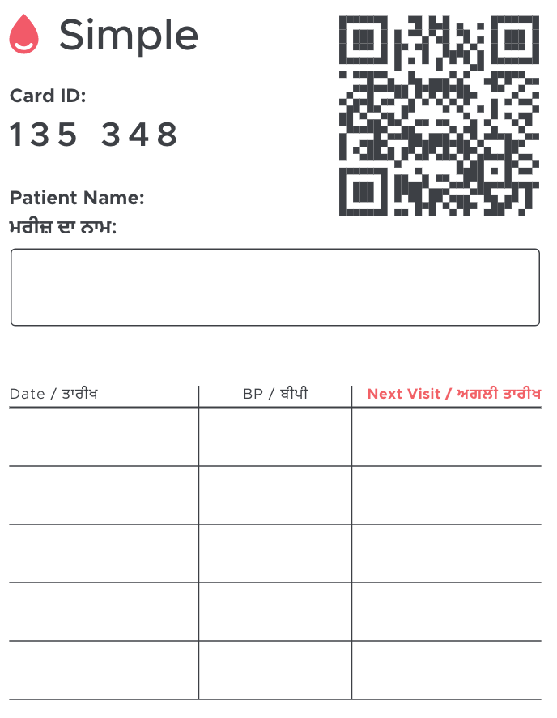
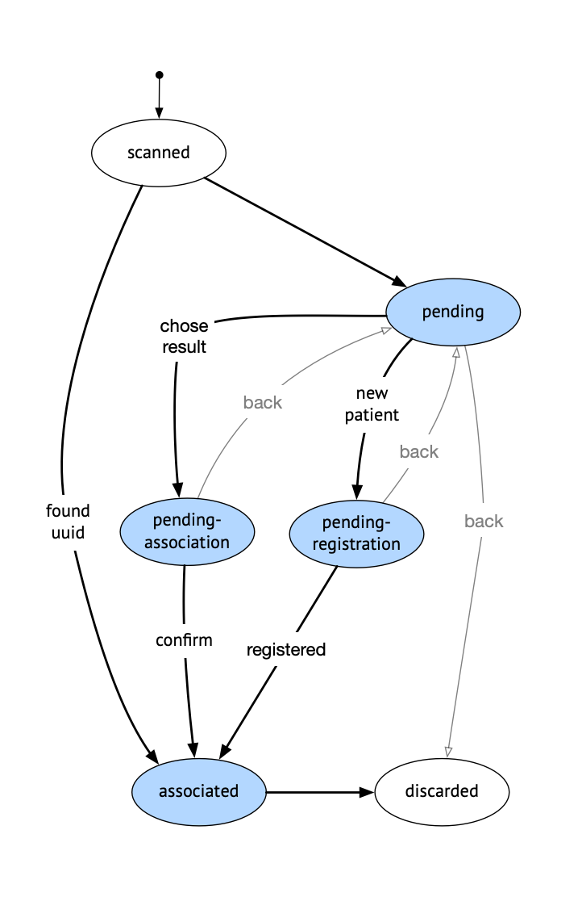

# Simple Cards

## Context

The case for a physical card ID: https://docs.google.com/document/d/1TFsXBtWU8SA3MnmJUcGK35ubcv-HvsM_H2zfRe5tDZo/edit#

Summarizing the above, there is a need for a patient card ID that quickly, and uniquely identifies a patient. The card can be used as a vehicle for BP history in the clinic, and serve as a reminder about the next visit date for the patient.

We want to allow a patient to cross simple networks, say, from IHMI to Path.

### Card IDs, not Patient IDs
Patients often lose their cards, and the nurses re-issue them. Since we ideally want the cards to have pre-printed QRs, these will have to be different QRs that a single patient can be associated with. So, a patient can have multiple cards.

Some places already have patient IDs. Like kerala, and maharashtra (dell system). These IDs can also be considered card IDs, that we can use to lookup a patient in Simple.


### Characteristics of the Card ID
1. The number shouldn't be guessable
  - Nurses shouldn't be able to lookup PHI randomly. The number shouldn't have any implicity meaning associated with it, eg. date of registration, date of birth, colony, village etc.
2. Clinics should be able to print their own IDs
  - In the future, we shouldn't be on the hook for printing these IDs.
3. We can associate multiple cards with a patient
  - Patients will lose cards, and we shouldn't need to print duplicate cards. Like hotel cards, we should be able to use another new card and associate it with the patient. The old card would also remain usable.
4. Scanning works cross simple networks
  - Scanning the card ID, when patient presents it, should allow clinics to gain access to PHI, even if they aren't in the same network. Example: a patient should be able to move from a private clinic at PATH, to a govt facility in IHMI.
5. Have a fallback for when scanning doesn't work
  - The card ID should be usable even if scanning doesn't work, and the camera is not operational. Ideally, this fallback should be a 7 digit number, that is easy for a nurse to type on a numeric keypad on a phone.

## Decision

We will use [UUID](https://en.wikipedia.org/wiki/Universally_unique_identifiehttps://en.wikipedia.org/wiki/Universally_unique_identifier)s as simple card IDs.

UUIDs (version 4) are random, unique, and can be generated algorithmically. These are used as IDs in distributed systems for the same reasons.

They are not sequential, are not guessable, and aren't dependent on a central system that guarrantees uniqueness. Clinics can generate their own UUIDs for their cards, in an offline system.

The density of the QRs that resolve to UUIDs is quite good, and scanning them doesn't have issues thus far.

### Fallback ID, numeric representation
We'll use a 6 or 7 digit ID, for when the QR scanning doesn't work. This number will be derived from the corresponding UUID by picking the digits that appear in the UUID, in sequence. For example, the UUID `17be9760-bd4c-4a31-9c21-c28b66919f52` will have the `179-7604` as the numeric ID.

#### Collisions
Unlike the UUID, which is unique, the numeric representation isn't unique. 2 UUIDs can have the same numeric representation. When searching by the digits, the app will show matches in the search results, and the nurse can pick the patient from the results. Since the patients in the search results aren't going to be similar (different names, etc), and there won't be many such collisions, this shouldn't be hard.

The space for this collision is roughly 16^7, or ~270 million (16^6 is ~16 million), which is comfortable for a large clinic in a metropolitan city.

#### Associating by the numeric representation

The following are the different ways in which a card ID can be associated with a patient.

| # | notes                          | patient-id | simple-card-id | digit-id |
|---|--------------------------------|------------|----------------|----------|
| 1 | associated by scanning QR      | uuid-1     | card-id-1      | derived  |
| 2 | issued new card by scanning QR | uuid-1     | card-id-2      | derived  |
| 3 | associated by numeric ID       | uuid-1     | ?              | entered  |

In the case that a card is associated using a numeric ID, the simple-card-id (UUID) isn't known, and the association is left dangling. If in the next visit the card is scanned, the app would show search results, and the nurse can confirm the association.

### Composition of the QR
We will have a simple json as the QR content:
```
{version: 'v1', id: '17be9760-bd4c-4a31-9c21-c28b66919f52'}
```
Having the version in the json lets us iterate over the content of the QR, while being backward compatible.


### Example simple card


### Simple card ID states
The state machine for a scanned card from the experiments app


## Status

Accepted

## Consequences
